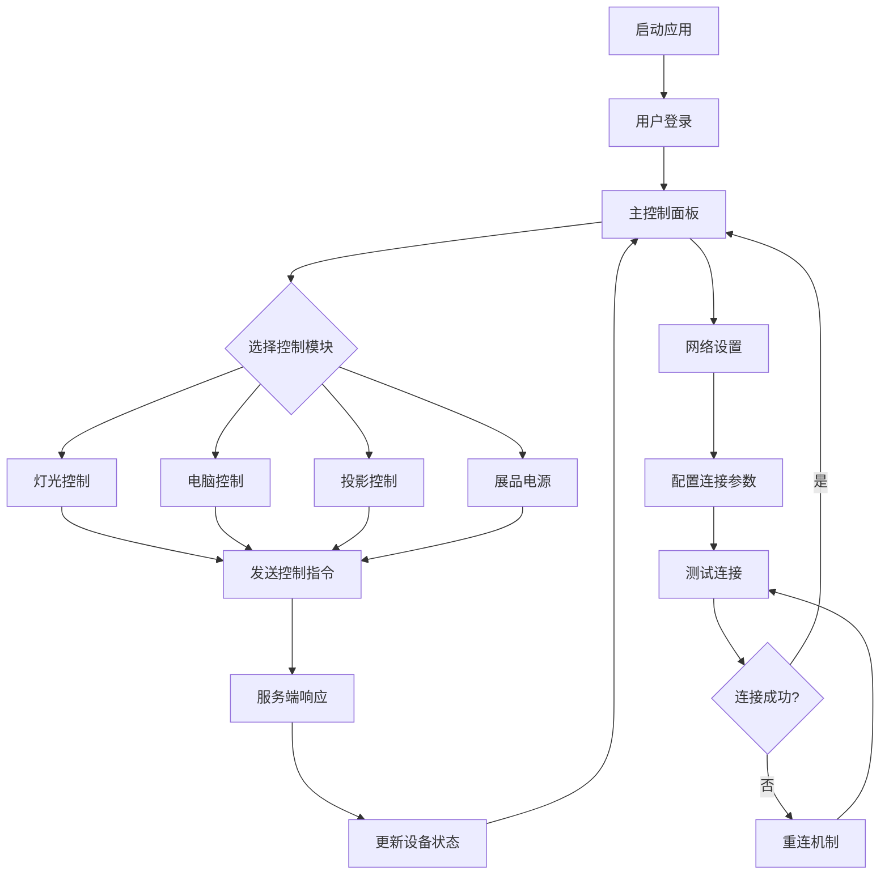

## 1. 产品概述
武汉节水科技馆中控系统是一款专为iPad mini 4 (iOS 10.2.1) 定制的智能控制应用，用于集中管理科技馆内的各类设备。通过TCP网络通信协议，实现对灯光、电脑、投影仪和展品电源的远程控制，提升场馆管理效率和用户体验。

目标用户为科技馆工作人员和管理员，通过直观的iOS原生界面，简化设备操作流程，确保场馆设备运行的稳定性和可靠性。

## 2. 核心功能

### 2.1 用户角色
| 角色 | 注册方式 | 核心权限 |
|------|----------|----------|
| 管理员 | 本地账户登录 | 控制所有设备、查看系统状态、配置网络参数 |
| 操作员 | 本地账户登录 | 控制指定设备类别、查看设备状态 |

### 2.2 功能模块
本中控系统包含以下核心页面：
1. **主控制面板**：设备状态概览、快速控制入口
2. **灯光控制页**：单独灯光开关、一键全开功能
3. **电脑控制页**：单独电脑开关、一键全开功能  
4. **投影控制页**：单独投影仪开关、一键全关功能
5. **展品电源页**：一键全开/全关功能
6. **网络设置页**：TCP连接配置、连接状态监测

### 2.3 页面详情
| 页面名称 | 模块名称 | 功能描述 |
|----------|----------|----------|
| 主控制面板 | 设备状态概览 | 实时显示所有设备在线状态、连接状态指示器 |
| 主控制面板 | 快速控制入口 | 提供各控制模块的快捷入口按钮 |
| 主控制面板 | 网络状态栏 | 显示TCP连接状态、信号强度、重连倒计时 |
| 灯光控制页 | 设备列表 | 显示所有灯光设备名称、当前开关状态 |
| 灯光控制页 | 单独控制 | 每个灯光设备的独立开关按钮 |
| 灯光控制页 | 批量控制 | 一键全开所有灯光设备 |
| 电脑控制页 | 设备列表 | 显示所有电脑设备名称、开关状态 |
| 电脑控制页 | 单独控制 | 每台电脑的独立开关按钮 |
| 电脑控制页 | 批量控制 | 一键全开所有电脑设备 |
| 投影控制页 | 设备列表 | 显示所有投影仪名称、开关状态 |
| 投影控制页 | 单独控制 | 每个投影仪的独立开关按钮 |
| 投影控制页 | 批量控制 | 一键全关所有投影仪设备 |
| 展品电源页 | 电源总控 | 一键全开/全关所有展品电源 |
| 展品电源页 | 状态指示 | 显示当前展品电源总体状态 |
| 网络设置页 | 连接配置 | 设置服务器IP地址、端口号 |
| 网络设置页 | 连接测试 | 手动测试TCP连接、显示连接日志 |
| 网络设置页 | 重连设置 | 配置自动重连间隔、重连次数限制 |

## 3. 核心流程

### 管理员操作流程
1. 启动应用后进入登录界面
2. 输入管理员账户登录系统
3. 进入主控制面板查看设备状态
4. 选择需要控制的设备类别（灯光/电脑/投影/展品）
5. 执行单独控制或批量控制操作
6. 系统通过TCP发送HEX格式指令到服务端
7. 接收服务端响应并更新设备状态显示

### 网络连接流程
1. 应用启动时尝试建立TCP连接
2. 连接成功后保持心跳检测
3. 断线时触发自动重连机制
4. 重连失败时显示错误提示并记录日志
5. 用户可手动重新配置连接参数

## 4. 用户界面设计

### 4.1 设计规范
- **主色调**：系统蓝色（RGB: 0, 122, 255）
- **辅助色**：系统绿色（开启状态）、系统红色（关闭状态）
- **背景色**：系统标准白色和浅灰色
- **按钮样式**：圆角矩形，符合iOS 10设计规范
- **字体**：SF Pro Text，标题18pt，正文16pt
- **图标**：使用SF Symbols系统图标库
- **布局**：卡片式布局，适配7.9英寸屏幕
- **动画**：使用iOS原生过渡动画，确保流畅性

### 4.2 页面设计概览
| 页面名称 | 模块名称 | UI元素 |
|----------|----------|----------|
| 主控制面板 | 状态概览 | 网格布局显示设备状态卡片，每个卡片包含设备图标、名称、状态指示灯 |
| 主控制面板 | 控制入口 | 底部工具栏，包含四个主要控制模块的图标按钮 |
| 灯光控制页 | 设备列表 | UITableView样式，每行显示设备名称和UISwitch开关 |
| 灯光控制页 | 批量控制 | 顶部导航栏右侧放置"全开"按钮 |
| 电脑控制页 | 设备列表 | 类似灯光控制页布局，使用电脑图标 |
| 投影控制页 | 设备列表 | 使用投影仪图标，"全关"按钮放置在右上角 |
| 展品电源页 | 电源控制 | 大尺寸的开关按钮，突出显示当前状态 |
| 网络设置页 | 配置表单 | 使用系统标准输入框和按钮，包含连接状态指示器 |

### 4.3 响应式设计
- 采用iPad mini 4原生分辨率（2048×1536）设计
- 支持横屏和竖屏两种显示模式
- 适配A8处理器性能，确保界面响应速度
- 针对7.9英寸屏幕优化触摸目标大小（最小44×44像素）

### 4.4 交互设计
- 滑动切换不同控制模块
- 长按设备项显示详细信息
- 下拉刷新设备状态
- 震动反馈确认操作成功
- 声音提示连接状态变化

## 5. 技术规格

### 5.1 开发环境
- 编程语言：Swift 3.x
- 最低系统版本：iOS 10.2.1
- 目标设备：iPad mini 4
- 处理器要求：Apple A8芯片
- 内存要求：最少1GB RAM

### 5.2 网络通信
- 协议类型：TCP/IP
- 数据格式：HEX格式指令
- 连接保持：后台心跳机制
- 断线重连：自动重连，可配置重连间隔
- 超时设置：连接超时30秒，读取超时10秒

### 5.3 性能要求
- 应用启动时间：≤ 3秒
- 界面响应时间：≤ 100毫秒
- TCP连接建立时间：≤ 5秒
- 内存占用：运行时≤ 100MB
- 电池优化：后台运行功耗≤ 5%/小时

## 6. 测试要求

### 6.1 功能测试
- **网络连接测试**：验证TCP连接建立、断开、重连功能
- **设备控制测试**：验证所有控制指令的正确性和响应性
- **批量操作测试**：验证一键全开/全关功能的准确性
- **状态同步测试**：验证设备状态显示的实时性和准确性

### 6.2 兼容性测试
- **系统兼容性**：在iOS 10.2.1至iOS 12系统上测试
- **设备适配性**：确保在iPad mini 4上的完美适配
- **网络环境测试**：在WiFi、4G等不同网络环境下测试
- **多任务处理**：测试应用在后台运行时的稳定性

### 6.3 性能测试
- **内存使用测试**：监控长时间运行的内存占用情况
- **CPU占用测试**：确保A8处理器能够流畅运行
- **电池消耗测试**：评估应用对设备续航的影响
- **网络流量测试**：监控数据传输的流量消耗

### 6.4 UI测试
- **界面适配测试**：验证在不同屏幕方向下的显示效果
- **触摸响应测试**：确保所有交互元素的正常响应
- **动画流畅性测试**：验证界面过渡动画的流畅度
- **可读性测试**：确保文字在各种光线条件下的可读性

### 6.5 稳定性测试
- **长时间运行测试**：连续运行24小时无崩溃
- **异常处理测试**：网络异常、服务器异常等情况的处理
- **并发操作测试**：多设备同时控制的稳定性
- **数据完整性测试**：确保控制指令不丢失、不重复