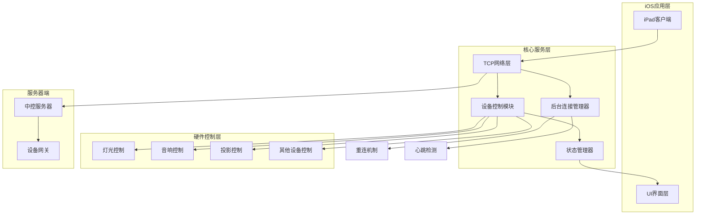
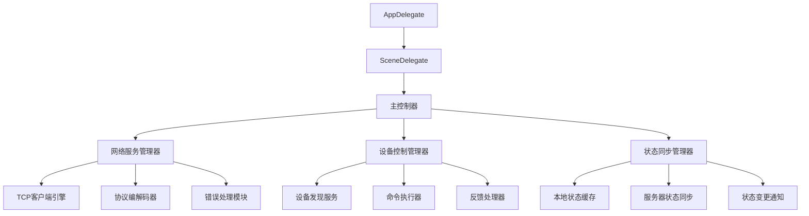
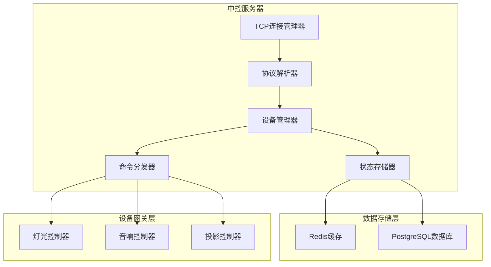
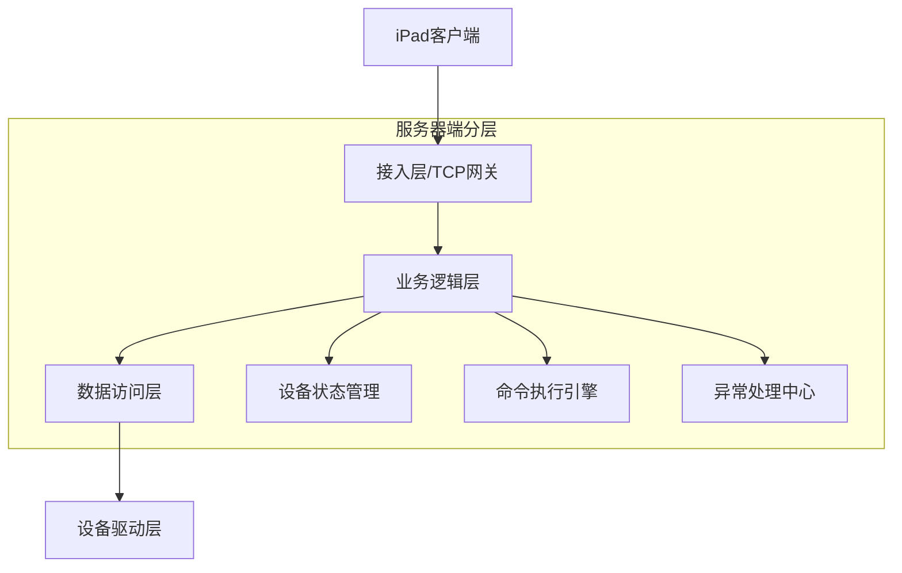
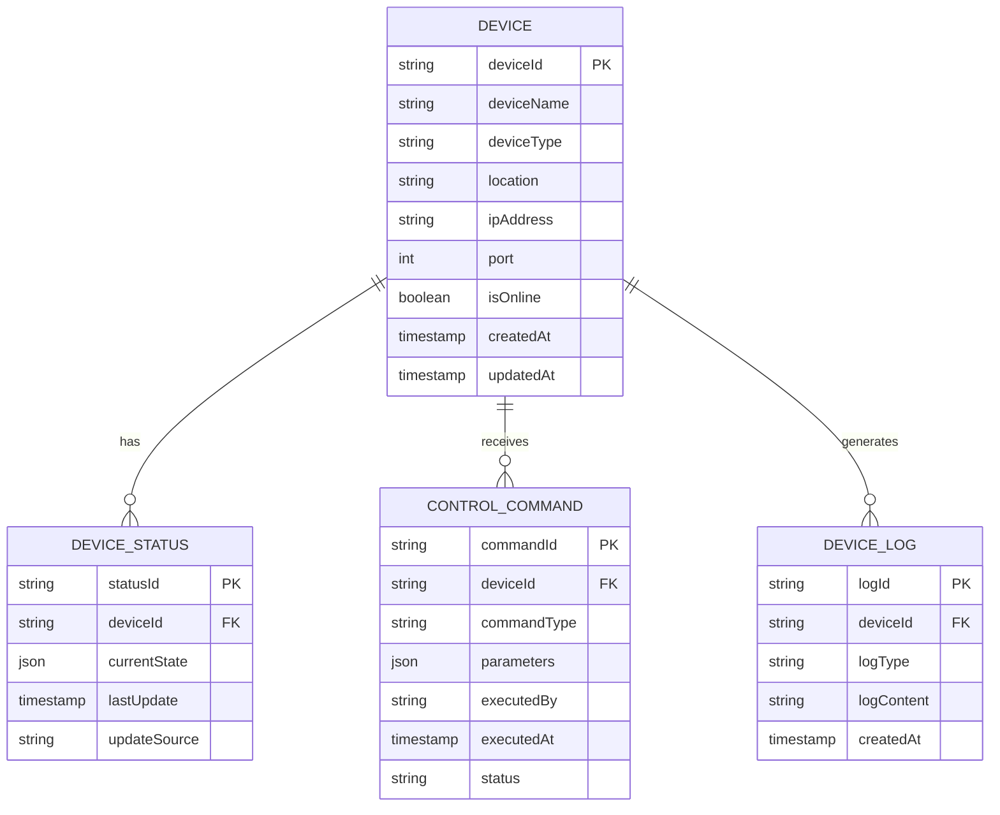
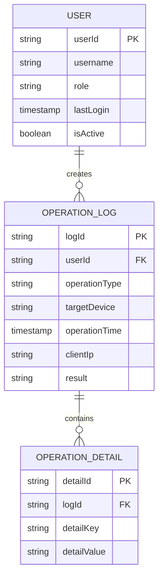

# 武汉水利科技馆iPad控制系统技术架构文档

## 1. 架构设计

### 1.1 整体架构



### 1.2 模块架构



## 2. 技术描述

### 2.1 核心技术栈

* **开发语言**: Swift 3.x

* **最低系统版本**: iOS 10.2.1

* **网络协议**: TCP/IP 原生Socket编程

* **架构模式**: MVC + 单例模式 + 观察者模式

* **第三方库**: CocoaAsyncSocket (TCP通信), SnapKit (自动布局)

* **开发工具**: Xcode 8.x, Swift 3.0编译器

### 2.2 兼容性考虑

* 支持32位和64位设备架构

* 适配iPad Pro、iPad Air、iPad mini系列

* 支持横屏和竖屏模式

* 考虑内存限制，优化图片和资源加载

## 3. 路由定义

| 路由/页面       | 功能描述              |
| ----------- | ----------------- |
| /main       | 主控制面板，显示所有可控制设备   |
| /lighting   | 灯光控制页面，调节亮度、色温等   |
| /audio      | 音响控制页面，音量调节、音效设置  |
| /projection | 投影控制页面，开关、信号源切换   |
| /settings   | 系统设置页面，网络配置、设备管理  |
| /status     | 设备状态监控页面，实时显示设备状态 |

## 4. API定义

### 4.1 TCP通信协议

#### 连接管理

```
CONNECT tcp://中控服务器IP:端口
```

请求参数：

| 参数名             | 类型     | 必需 | 描述         |
| --------------- | ------ | -- | ---------- |
| deviceId        | String | 是  | iPad设备唯一标识 |
| authToken       | String | 是  | 认证令牌       |
| protocolVersion | String | 是  | 协议版本号      |

#### 设备控制命令

```
COMMAND device_control
```

请求格式：

```json
{
  "command": "device_control",
  "deviceType": "lighting|audio|projection",
  "deviceId": "设备ID",
  "action": "on|off|adjust",
  "parameters": {
    "brightness": 0-100,
    "volume": 0-100,
    "colorTemperature": 2700-6500
  },
  "timestamp": 1234567890
}
```

响应格式：

```json
{
  "status": "success|error",
  "code": 200,
  "message": "操作成功",
  "data": {
    "deviceId": "设备ID",
    "currentState": "当前状态",
    "executedAt": "执行时间"
  }
}
```

### 4.2 状态同步协议

#### 心跳检测

```
HEARTBEAT ping
```

#### 状态查询

```
QUERY device_status
```

## 5. 服务器架构

### 5.1 中控服务器架构



### 5.2 服务分层设计



## 6. 数据模型

### 6.1 设备数据模型



### 6.2 用户操作日志模型



## 7. 关键技术实现

### 7.1 TCP网络层设计

#### 7.1.1 连接管理器

```swift
class TCPConnectionManager: NSObject, GCDAsyncSocketDelegate {
    private var socket: GCDAsyncSocket?
    private let host: String
    private let port: UInt16
    private var isConnected: Bool = false
    private var reconnectTimer: Timer?
    private var heartbeatTimer: Timer?
    
    // 单例模式
    static let shared = TCPConnectionManager()
    
    // 连接建立
    func establishConnection() {
        socket = GCDAsyncSocket(delegate: self, delegateQueue: DispatchQueue.main)
        do {
            try socket?.connect(toHost: host, onPort: port, withTimeout: 10.0)
        } catch {
            handleConnectionError(error)
        }
    }
    
    // 心跳检测
    func startHeartbeat() {
        heartbeatTimer = Timer.scheduledTimer(withTimeInterval: 30.0, repeats: true) { _ in
            self.sendHeartbeat()
        }
    }
    
    // 自动重连
    func setupAutoReconnect() {
        reconnectTimer = Timer.scheduledTimer(withTimeInterval: 5.0, repeats: true) { _ in
            if !self.isConnected {
                self.establishConnection()
            }
        }
    }
}
```

#### 7.1.2 协议编解码器

```swift
class ProtocolCodec {
    // 编码命令
    static func encodeCommand(_ command: Command) -> Data? {
        let jsonData = try? JSONSerialization.data(withJSONObject: command.toDictionary())
        guard let data = jsonData else { return nil }
        
        // 添加长度前缀
        let length = UInt32(data.count)
        var result = Data()
        result.append(contentsOf: withUnsafeBytes(of: length.bigEndian) { Data($0) })
        result.append(data)
        
        return result
    }
    
    // 解码响应
    static func decodeResponse(_ data: Data) -> Response? {
        guard data.count >= 4 else { return nil }
        
        let length = UInt32(bigEndian: data.withUnsafeBytes { $0.load(as: UInt32.self) })
        guard data.count >= 4 + Int(length) else { return nil }
        
        let jsonData = data.subdata(in: 4..<(4 + Int(length)))
        let jsonObject = try? JSONSerialization.jsonObject(with: jsonData, options: [])
        
        return Response.fromDictionary(jsonObject as? [String: Any] ?? [:])
    }
}
```

### 7.2 设备控制模块

#### 7.2.1 设备管理器

```swift
class DeviceManager {
    private var devices: [String: Device] = [:]
    private let commandExecutor: CommandExecutor
    private let statusMonitor: StatusMonitor
    
    // 设备发现
    func discoverDevices() {
        let discoveryCommand = Command(type: .discover, parameters: [:])
        TCPConnectionManager.shared.sendCommand(discoveryCommand) { response in
            self.handleDiscoveredDevices(response.data)
        }
    }
    
    // 设备控制
    func controlDevice(_ deviceId: String, action: DeviceAction, parameters: [String: Any]) {
        guard let device = devices[deviceId] else { return }
        
        let command = Command(
            type: .control,
            deviceId: deviceId,
            deviceType: device.type,
            action: action,
            parameters: parameters
        )
        
        commandExecutor.execute(command) { result in
            self.handleControlResult(deviceId, result: result)
        }
    }
    
    // 状态更新
    func updateDeviceStatus(_ deviceId: String, status: DeviceStatus) {
        devices[deviceId]?.status = status
        NotificationCenter.default.post(name: .deviceStatusUpdated, object: deviceId)
    }
}
```

#### 7.2.2 状态同步管理器

```swift
class StatusSyncManager {
    private var localStatusCache: [String: DeviceStatus] = [:]
    private var syncTimer: Timer?
    private let syncInterval: TimeInterval = 5.0
    
    func startSync() {
        syncTimer = Timer.scheduledTimer(withTimeInterval: syncInterval, repeats: true) { _ in
            self.syncDeviceStatus()
        }
    }
    
    private func syncDeviceStatus() {
        let statusQuery = Command(type: .queryStatus, parameters: [:])
        TCPConnectionManager.shared.sendCommand(statusQuery) { response in
            self.updateLocalCache(response.data)
            self.notifyStatusChanges()
        }
    }
    
    private func updateLocalCache(_ statusData: [String: Any]) {
        for (deviceId, status) in statusData {
            if let deviceStatus = DeviceStatus.fromDictionary(status as? [String: Any] ?? [:]) {
                localStatusCache[deviceId] = deviceStatus
            }
        }
    }
}
```

### 7.3 iOS 10.2.1兼容性处理

#### 7.3.1 后台运行支持

```swift
class BackgroundTaskManager {
    private var backgroundTask: UIBackgroundTaskIdentifier = .invalid
    
    func beginBackgroundTask() {
        backgroundTask = UIApplication.shared.beginBackgroundTask(withName: "TCPConnection") {
            self.endBackgroundTask()
        }
    }
    
    func endBackgroundTask() {
        if backgroundTask != .invalid {
            UIApplication.shared.endBackgroundTask(backgroundTask)
            backgroundTask = .invalid
        }
    }
    
    func maintainConnectionInBackground() {
        beginBackgroundTask()
        
        // 在后台维持TCP连接
        DispatchQueue.global(qos: .background).async {
            while UIApplication.shared.applicationState == .background {
                TCPConnectionManager.shared.sendHeartbeat()
                Thread.sleep(forTimeInterval: 30.0)
            }
            self.endBackgroundTask()
        }
    }
}
```

#### 7.3.2 内存管理优化

```swift
class MemoryManager {
    static func optimizeForIOS10() {
        // 清理图片缓存
        URLCache.shared.memoryCapacity = 4 * 1024 * 1024 // 4MB
        URLCache.shared.diskCapacity = 20 * 1024 * 1024 // 20MB
        
        // 优化视图控制器生命周期
        NotificationCenter.default.addObserver(
            forName: UIApplication.didReceiveMemoryWarningNotification,
            object: nil,
            queue: .main
        ) { _ in
            self.clearUnusedResources()
        }
    }
    
    private static func clearUnusedResources() {
        // 清理未使用的资源
        ImageCache.shared.clearMemoryCache()
        DataCache.shared.clearTemporaryData()
    }
}
```

## 8. 测试架构

### 8.1 单元测试架构

```swift
// 网络层测试
class TCPConnectionManagerTests: XCTestCase {
    var connectionManager: TCPConnectionManager!
    
    override func setUp() {
        super.setUp()
        connectionManager = TCPConnectionManager.shared
    }
    
    func testConnectionEstablishment() {
        let expectation = self.expectation(description: "Connection established")
        
        connectionManager.establishConnection { success in
            XCTAssertTrue(success, "Connection should be established")
            expectation.fulfill()
        }
        
        waitForExpectations(timeout: 10, handler: nil)
    }
    
    func testHeartbeatMechanism() {
        let expectation = self.expectation(description: "Heartbeat sent")
        
        connectionManager.sendHeartbeat { response in
            XCTAssertNotNil(response, "Heartbeat response should be received")
            expectation.fulfill()
        }
        
        waitForExpectations(timeout: 5, handler: nil)
    }
}
```

### 8.2 集成测试架构

```swift
class DeviceControlIntegrationTests: XCTestCase {
    var deviceManager: DeviceManager!
    var mockTCPServer: MockTCPServer!
    
    override func setUp() {
        super.setUp()
        mockTCPServer = MockTCPServer()
        mockTCPServer.start()
        deviceManager = DeviceManager()
    }
    
    func testDeviceDiscoveryAndControl() {
        let discoveryExpectation = expectation(description: "Device discovered")
        let controlExpectation = expectation(description: "Device controlled")
        
        // 设备发现
        deviceManager.discoverDevices { devices in
            XCTAssertGreaterThan(devices.count, 0, "Devices should be discovered")
            discoveryExpectation.fulfill()
            
            // 设备控制
            if let firstDevice = devices.first {
                self.deviceManager.controlDevice(firstDevice.id, action: .turnOn) { result in
                    XCTAssertTrue(result.success, "Device should be controlled successfully")
                    controlExpectation.fulfill()
                }
            }
        }
        
        waitForExpectations(timeout: 15, handler: nil)
    }
}
```

### 8.3 UI测试架构

```swift
class ControlPanelUITests: XCTestCase {
    var app: XCUIApplication!
    
    override func setUp() {
        super.setUp()
        continueAfterFailure = false
        app = XCUIApplication()
        app.launch()
    }
    
    func testDeviceControlFlow() {
        // 等待主界面加载
        let mainView = app.otherElements["MainControlView"]
        XCTAssertTrue(mainView.waitForExistence(timeout: 5), "Main view should be visible")
        
        // 测试灯光控制
        let lightingButton = app.buttons["LightingControl"]
        lightingButton.tap()
        
        let brightnessSlider = app.sliders["BrightnessSlider"]
        brightnessSlider.adjust(toNormalizedSliderPosition: 0.7)
        
        // 验证状态更新
        let statusLabel = app.staticTexts["DeviceStatus"]
        XCTAssertTrue(statusLabel.label.contains("亮度: 70%"), "Status should be updated")
    }
}
```

## 9. 性能优化

### 9.1 网络性能优化

* 使用连接池管理TCP连接

* 实现请求队列和重试机制

* 数据压缩和批量发送

* 智能心跳间隔调整

### 9.2 内存优化

* 图片懒加载和缓存策略

* 对象池模式重用频繁创建的对象

* 及时释放未使用的资源

* 监控内存使用情况

### 9.3 电量优化

* 合理控制后台任务执行频率

* 批量处理网络请求

* 使用低功耗蓝牙替代WiFi（如适用）

* 优化GPS和网络定位使用

## 10. 安全考虑

### 10.1 通信安全

* TCP连接使用TLS/SSL加密

* 实现双向认证机制

* 敏感数据加密存储

* 防止中间人攻击

### 10.2 认证授权

* 用户登录认证

* 设备操作权限控制

* 会话管理

* 操作日志记录

### 10.3 数据保护

* 本地数据加密存储

* 网络传输数据加密

* 防止SQL注入和XSS攻击

* 定期安全审计

## 11. 错误处理与恢复

### 11.1 网络错误处理

```swift
enum NetworkError: Error {
    case connectionTimeout
    case connectionLost
    case invalidResponse
    case authenticationFailed
    case serverError(code: Int)
}

class ErrorHandler {
    static func handleNetworkError(_ error: NetworkError) {
        switch error {
        case .connectionTimeout:
            showAlert("连接超时", message: "请检查网络连接")
            TCPConnectionManager.shared.attemptReconnection()
            
        case .connectionLost:
            showAlert("连接断开", message: "正在尝试重新连接...")
            BackgroundTaskManager.shared.maintainConnectionInBackground()
            
        case .authenticationFailed:
            showAlert("认证失败", message: "请重新登录")
            navigateToLoginScreen()
            
        default:
            showAlert("网络错误", message: "请稍后重试")
        }
    }
}
```

### 11.2 设备控制错误处理

* 设备无响应超时处理

* 设备状态异常检测

* 控制命令重试机制

* 用户友好的错误提示

## 12. 部署与维护

### 12.1 应用发布

* App Store企业签名发布

* 内部测试和灰度发布

* 版本管理和更新机制

* 崩溃日志收集和分析

### 12.2 运维监控

* 服务器性能监控

* 网络连接质量监控

* 设备在线状态监控

* 用户操作行为分析

### 12.3 故障排查

* 详细的日志记录系统

* 远程诊断和调试支持

* 常见问题解决方案

* 技术支持响应机制

