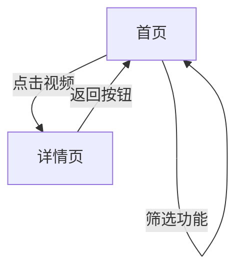

## 1. 产品概述
这是一个响应式视频资料库网站，采用iOS风格设计，集成腾讯云文档型数据库，为用户提供流畅的视频浏览体验。
- 解决视频内容管理和展示需求，为移动端和PC端用户提供一致的体验
- 目标用户：需要浏览和查看视频资料的个人用户和企业用户
- 市场价值：提供现代化的视频内容展示平台，支持多设备访问

## 2. 核心功能

### 2.1 用户角色
| 角色 | 注册方式 | 核心权限 |
|------|----------|----------|
| 访客用户 | 无需注册 | 浏览视频列表、查看视频详情、搜索筛选 |
| 管理员 | 后台管理系统 | 管理视频内容、配置系统设置 |

### 2.2 功能模块
视频资料库网站包含以下主要页面：
1. **首页**：视频网格展示、搜索筛选、无限滚动
2. **详情页**：视频详细信息展示、播放功能、返回导航

### 2.3 页面详情
| 页面名称 | 模块名称 | 功能描述 |
|-----------|-------------|-------------|
| 首页 | 导航栏 | 显示页面标题、菜单按钮，支持响应式布局 |
| 首页 | 视频网格 | 展示视频封面、名称、时长，支持懒加载 |
| 首页 | 搜索筛选 | 提供关键词搜索和筛选功能 |
| 首页 | 加载更多 | 实现无限滚动或分页加载 |
| 详情页 | 顶部导航 | 显示返回按钮、页面标题、分享功能 |
| 详情页 | 视频封面 | 展示大尺寸封面图片 |
| 详情页 | 视频信息 | 显示名称、时长、简介等详细信息 |
| 详情页 | 播放控制 | 提供播放按钮和相关控制功能 |

## 3. 核心流程
用户操作流程：
1. 用户访问首页，浏览视频列表
2. 可通过搜索框输入关键词搜索视频
3. 点击视频封面进入详情页
4. 在详情页查看完整信息并可播放视频
5. 点击返回按钮回到首页

## 4. 用户界面设计

### 4.1 设计风格
- **主色调**：#007AFF（iOS系统蓝）
- **按钮样式**：圆角矩形，采用iOS原生按钮样式
- **字体**：San Francisco（优先），回退到Helvetica Neue
- **布局风格**：卡片式布局，遵循Apple Human Interface Guidelines
- **图标风格**：线性图标，iOS系统图标风格
- **动画效果**：60fps流畅动画，包括平滑过渡、弹性效果、微交互反馈

### 4.2 页面设计概述
| 页面名称 | 模块名称 | UI元素 |
|-----------|-------------|-------------|
| 首页 | 导航栏 | 白色背景，黑色文字，居中标题，右侧菜单按钮 |
| 首页 | 视频卡片 | 白色圆角卡片，阴影效果，包含封面图、标题、年份标签 |
| 首页 | 网格布局 | 响应式网格，PC端4列，平板2列，手机1列 |
| 详情页 | 顶部导航 | 左侧返回按钮，居中标题，右侧分享和收藏按钮 |
| 详情页 | 封面展示 | 全宽显示，圆角处理，下方渐变遮罩 |
| 详情页 | 信息卡片 | 白色圆角卡片，包含标题、元信息、简介内容 |

### 4.3 响应式设计
- **桌面优先**：基于桌面端设计，向下适配移动端
- **断点设置**：
  - 移动端：< 768px
  - 平板端：768px - 1024px
  - 桌面端：> 1024px
- **触摸优化**：触摸目标尺寸≥44×44像素，支持触摸手势
- **适配测试**：覆盖iPhone各尺寸和主流Android设备

### 4.4 性能要求
- **加载性能**：首屏加载时间≤2秒
- **图片优化**：实现懒加载，支持WebP格式
- **缓存策略**：数据库查询结果本地缓存
- **流畅度**：所有动画保持60fps，滚动流畅无卡顿

### 4.5 可访问性
- **颜色对比度**：符合WCAG 2.1 AA标准
- **字体大小**：最小16px，支持用户缩放
- **键盘导航**：支持Tab键导航和Enter键操作
- **屏幕阅读器**：提供适当的ARIA标签