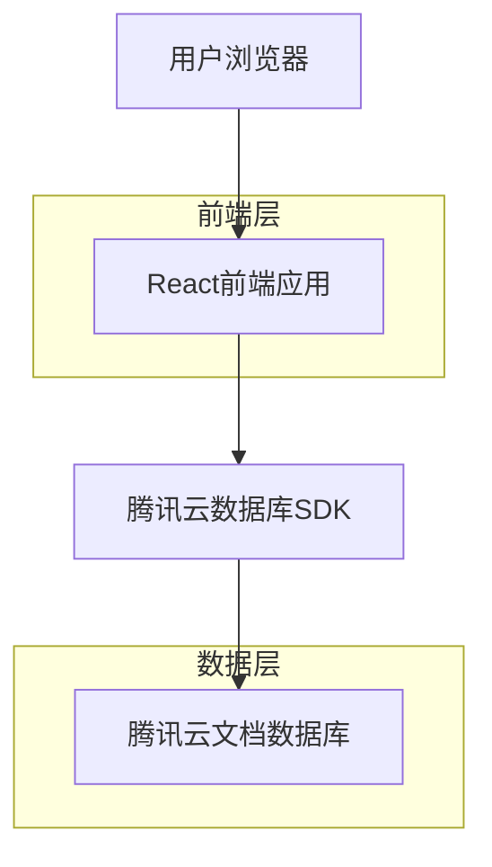
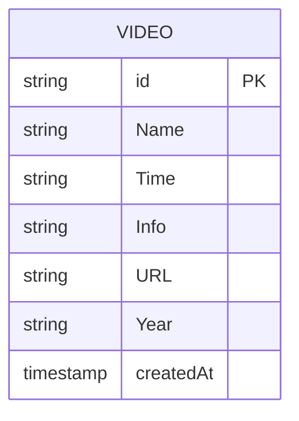

## 1. 架构设计



## 2. 技术描述

- **前端**：React@18 + TypeScript + Tailwind CSS@3 + Vite
- **初始化工具**：vite-init
- **数据库**：腾讯云文档型数据库（Tencent Cloud Base）
- **UI框架**：自定义iOS风格组件
- **动画库**：Framer Motion（用于实现iOS风格动画）
- **图片优化**：react-lazyload（懒加载）

## 3. 路由定义

| 路由 | 用途 |
|-------|---------|
| / | 首页，显示视频网格列表 |
| /video/:id | 视频详情页，显示选中视频的详细信息 |

## 4. 数据模型

### 4.1 数据模型定义



### 4.2 数据库结构

**WhHan集合（视频数据表）**
```json
{
  "_id": "string",
  "Name": "string",      // 影片名称
  "Time": "string",      // 影片时长
  "Info": "string",      // 影片简介
  "URL": "string",       // 封面图片地址
  "Year": "string",      // 发布年份
  "createdAt": "timestamp"
}
```

### 4.3 腾讯云数据库配置

```javascript
// 数据库初始化配置
const tcb = require('@cloudbase/js-sdk')

const app = tcb.init({
  env: 'your-env-id',      // 腾讯云环境ID
  region: 'ap-guangzhou'   // 地域配置
})

const db = app.database()
const videoCollection = db.collection('WhHan')
```

## 5. 前端架构

### 5.1 组件结构
```
src/
├── components/           # 通用组件
│   ├── VideoCard/      # 视频卡片组件
│   ├── VideoGrid/      # 视频网格组件
│   ├── SearchBar/      # 搜索栏组件
│   └── Loading/        # 加载状态组件
├── pages/               # 页面组件
│   ├── Home/           # 首页
│   └── VideoDetail/    # 视频详情页
├── hooks/               # 自定义Hooks
│   ├── useVideos.ts    # 视频数据获取
│   └── useSearch.ts    # 搜索功能
├── utils/               # 工具函数
│   ├── tcb.ts          # 腾讯云数据库配置
│   └── animation.ts    # 动画配置
└── styles/              # 样式文件
    ├── globals.css     # 全局样式
    └── ios-theme.css   # iOS主题样式
```

### 5.2 状态管理
- 使用React Context API管理全局状态
- 本地状态使用useState和useReducer
- 数据缓存使用localStorage

### 5.3 响应式实现
```css
/* 断点配置 */
@media (max-width: 767px) { /* 移动端 */ }
@media (min-width: 768px) and (max-width: 1023px) { /* 平板端 */ }
@media (min-width: 1024px) { /* 桌面端 */ }
```

## 6. 性能优化策略

### 6.1 图片优化
- 使用WebP格式图片
- 实现图片懒加载
- 响应式图片尺寸
- CDN加速

### 6.2 数据优化
- 分页加载（每页20条）
- 数据缓存（5分钟有效期）
- 防抖搜索（300ms延迟）
- 虚拟滚动（大数据量时）

### 6.3 代码优化
- 组件懒加载
- 代码分割
- Tree Shaking
- Gzip压缩

## 7. 动画实现

### 7.1 iOS风格动画配置
```javascript
// 页面过渡动画
const pageTransition = {
  initial: { opacity: 0, x: 100 },
  animate: { opacity: 1, x: 0 },
  exit: { opacity: 0, x: -100 },
  transition: { duration: 0.3, ease: 'easeInOut' }
}

// 卡片悬停效果
const cardHover = {
  scale: 1.02,
  transition: { duration: 0.2, ease: 'easeOut' }
}
```

## 8. 部署配置

### 8.1 腾讯云部署
```bash
# 安装云开发CLI
npm install -g @cloudbase/cli

# 登录腾讯云
cloudbase login

# 部署到云开发环境
cloudbase deploy
```

### 8.2 环境变量配置
```bash
# .env文件
VITE_TCB_ENV_ID=your-env-id
VITE_TCB_REGION=ap-guangzhou
VITE_CDN_URL=https://your-cdn-url
```

## 9. 测试策略

### 9.1 跨设备测试清单
- [ ] iPhone SE/12/13/14系列
- [ ] Samsung Galaxy S系列
- [ ] iPad各尺寸
- [ ] 主流Android平板
- [ ] 桌面端Chrome/Safari/Firefox/Edge

### 9.2 性能测试指标
- 首屏加载时间 ≤ 2秒
- 交互响应时间 ≤ 100ms
- 动画帧率 ≥ 60fps
- 内存占用 ≤ 200MB

### 9.3 可访问性测试
- 颜色对比度 ≥ 4.5:1
- 键盘导航完整性
- 屏幕阅读器兼容性
- 触摸目标尺寸 ≥ 44×44px